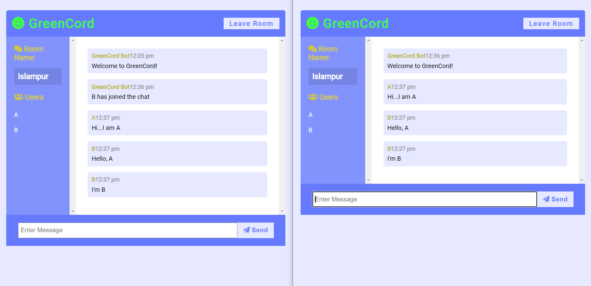

<h2>GreenCord App - part of environment project</h2>

<p>Realtime chat app with WebSockets using Node.js, Express, and Socket.io with Vanilla JS on the frontend with a custom UI.</p>
<h2>Deployment<h2>

To deploy this project run

```bash
  npm install
```
```bash
  npm run dev
```
```bash
Go to localhost:3000
```

<h2>Snap of chatapp</h2>
<h4>Homepage<h4>

<h4>Chat UI<h4>

<h4>Chat UI<h4>

