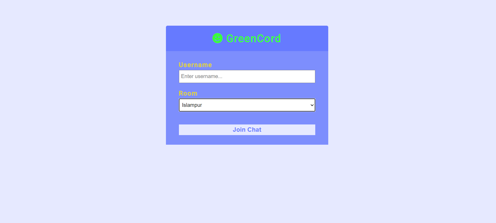
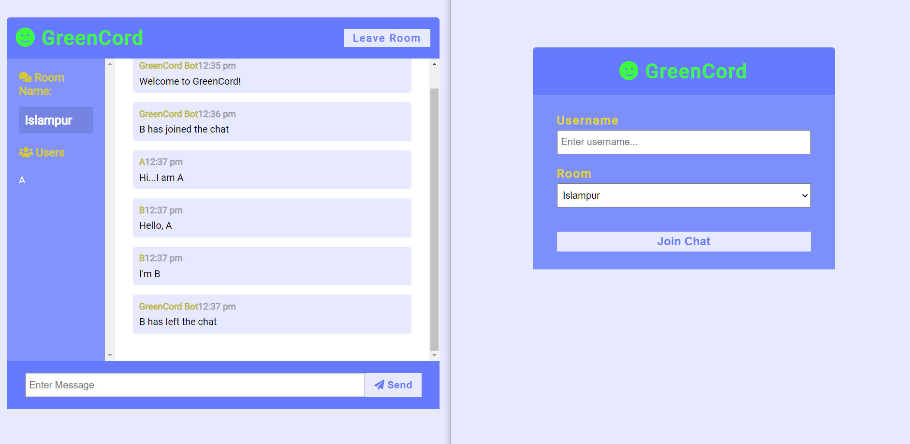

<h2>GreenCord App - part of environment project</h2>

Realtime chat app with websockets using Node.js, Express and Socket.io with Vanilla JS on the frontend with a custom UI

<h4>Try it out in your machine...</h4>

npm install 
npm run dev 

Go to localhost:3000 

<h4>Snap of chatapp</h4>

